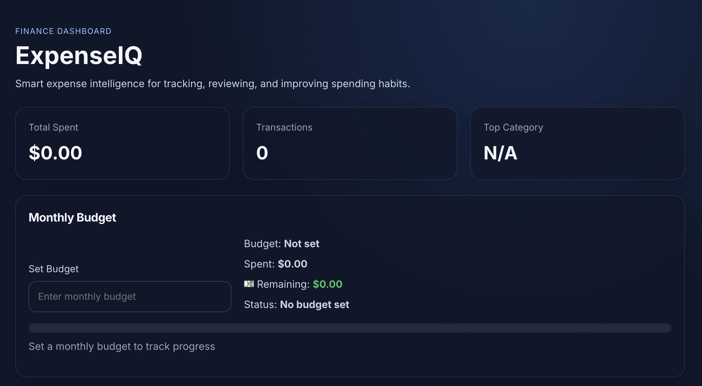

  

<h1 align="left">Kevin Jerome</h1>

  <b>Software Engineer • Full-Stack Developer • iOS Developer • Builder</b>

  
  
  

  

  

---

## 🧠 About Me

I'm a Computer Science student at Florida International University (Class of 2026) focused on building impactful, scalable, and user-centered applications.

I approach development like a system from planning and architecture to execution and optimization.

Currently building:
- ⚡ ExpenseIQ (Fintech Dashboard)
- ⏳ Kairos (Time Management Platform)
- 🚀 AI-Powered Application

---

## 📊 Stats

  
  
  

---

## 🧰 Languages & Tools

  

---

## 🚀 Featured Projects

<table>
<tr>

<td width="33%">
<h3 align="center">📊 ExpenseIQ</h3>

  

  Fintech dashboard inspired by modern platforms like Ramp. 
  Built for analytics, insights, and performance.

  <a href="https://github.com/SpikeTek241/ExpenseIQ">View Project</a>

</td>

<td width="33%">
<h3 align="center">⏳ Kairos</h3>

  

  Collaborative time management system designed 
  for productivity and structured workflows.

  <a href="#">View Project</a>

</td>

<td width="33%">
<h3 align="center">🚀 Titan</h3>

  

  Upcoming AI-powered product focused on 
  performance, scale, and real-world impact.

  Coming Soon

</td>

</tr>
</table>

---

## 🌐 Connect With Me

  
  

---

## ⚡ Fun Fact

I treat development like engineering systems not just writing code, but building products that scale, perform, and solve real problems.
