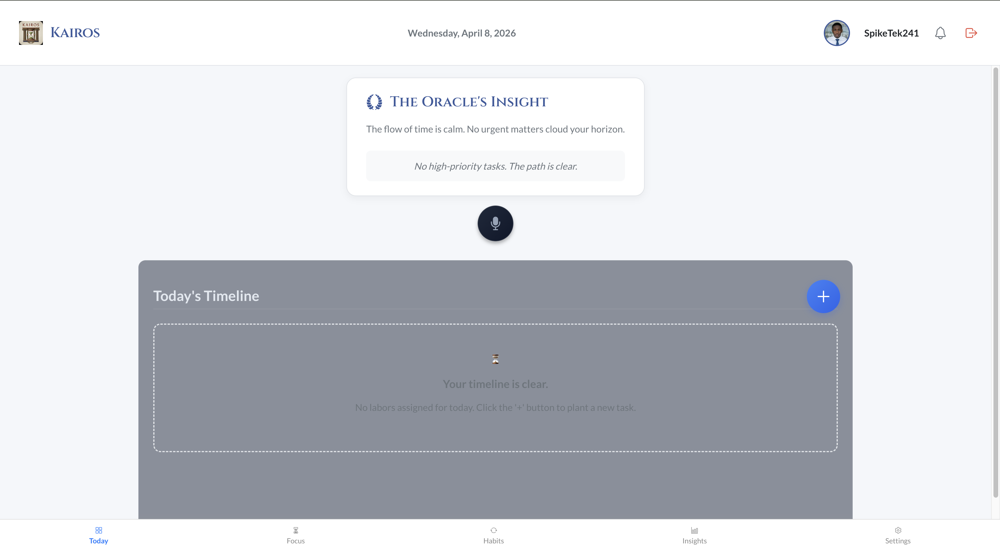

  

<h1 align="left">Kevin Jerome</h1>

  <b>Software Engineer &nbsp;•&nbsp; Full-Stack Developer &nbsp;•&nbsp; iOS Developer &nbsp;•&nbsp; Builder</b>

  
  
  
  
  

---

## 🧠 About Me

I'm a Computer Science student at Florida International University (Class of 2026), focused on building impactful, scalable, and user-centered applications. I approach development like a system — from planning and architecture to execution and optimization.

**Currently building:**

- ⚡ **ExpenseIQ** — Fintech dashboard for analytics and financial insights
- ⏳ **Kairos** — Collaborative time management platform for structured workflows
- 🎓 **Universal Educational Empowerment** — AI-powered platform for accessible education
- 🤖 **AI Application** — Coming soon

---

## 🧰 Languages & Tools

  

---

## 📊 GitHub Stats

  
  

---

## 🚀 Featured Projects

<table>
<tr>

<td width="33%" valign="top">
<h3 align="center">📊 ExpenseIQ</h3>

  

  Fintech dashboard inspired by modern platforms like Ramp. 
  Built for analytics, insights, and financial performance.

  <a href="https://github.com/SpikeTek241/ExpenseIQ">View Project →</a>

</td>

<td width="33%" valign="top">
<h3 align="center">⏳ Kairos</h3>

  

  Collaborative time management system designed 
  for productivity and structured workflows.

  <a href="https://github.com/Kairos-Moment/kairos-app">View Project →</a>

</td>

<td width="33%" valign="top">
<h3 align="center">🎓 Universal Educational Empowerment</h3>

  

  AI-powered platform focused on accessible, scalable education 
  and real-world academic impact.

  <a href="https://github.com/SpikeTek241/Universal-Educational-Empowerment">View Project →</a>

</td>

</tr>
</table>

---

## 🌐 Connect With Me

  
  

